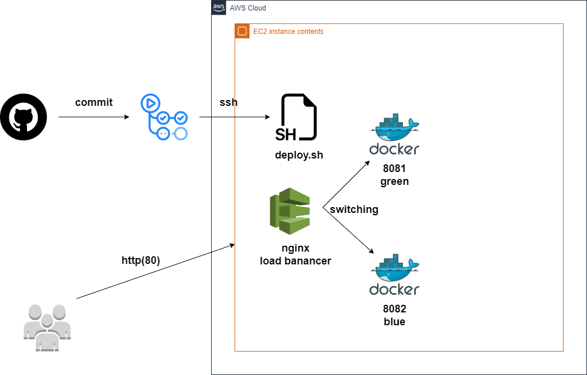
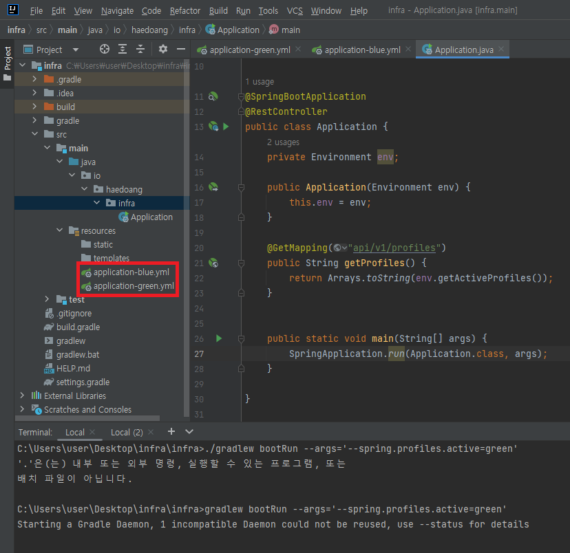

# 무중단배포(Blue/Green)

## 구성도



## 개발환경

- github
- github actions
- spring boot
- docker, docker-compose
- aws ec2

## 워크플로우

1. `commit` 이 수행되면 `Dockerfile` 을 사용하여 애플리케이션을 빌드합니다
2. 빌드한 애플리케이션을 `dockerhub` 이미지에 업로드합니다
3. 원격지 서버에 접속하여 `[deploy.sh](http://deploy.sh)` 파일을 실행합니다
4. `[deploy.sh](http://deploy.sh)` 에서는 새 이미지를 다운받아 실행중이지 않은 컨테이너에 이미지를 반영합니다
5. 반영된 이미지로 로드밸런서 설정을 변경합니다
6. 기존 실행중이었던 컨테이너를 종료합니다

## 개발환경 구축하기

### 1) 웹 어플리케이션 구현하기

- 현재 프로파일을 확인할 `application-green.yml` , `application-blue.yml` 파일을 추가
- 현재 프로파일을 조회할 api를 추가한다



- `setting.gradle` 설정 추가(plain.jar 생성안되게 설정)

```groovy
jar {
    enabled = false
}
```

### 2) 웹 어플리케이션을 Dockerfile로 만들기

- Dockerfile

```docker
FROM adoptopenjdk/openjdk11:alpine-jre
ARG JAR_FILE=./build/libs/*.jar
COPY ${JAR_FILE} app.jar
ENTRYPOINT ["java", "-jar", "app.jar"]
```

- 도커이미지 빌드하기

```docker
//app build
gradlew clean build -x test

//docker build 
docker build -t haedoang/testwebapp .
```


- 이미지 생성과 해당 이미지에 `profile` 적용 확인


- 도커 이미지 push하기


### 3) github action으로 리파지토리 변경 시 docker hub에 이미지를 업로드하기

`github action` 이란 github에서 제공하는 리파지토리의 변경(이벤트)에 대해 job을 수행하게 해주는 것을 말한다. 앞으로 해야할 작업들을 나열을 하면 아래와 같다. 

- [ ]  `commit` 이 되면 어플리케이션을 `build` 한다
- [ ]  `build` 가 된 어플리케이션을 `[docker.io](http://dockerhub.io)` 리파지토리에 push 한다
- [ ]  `remote server` 원격지 서버에 접속(ssh)하여 배포 업무를 수행할 `deploy.sh` 파일을 실행한다

- .github/workflows/cicd.yml

```yaml
name: cicd

on:
  push:
    branches:
      - 'master'
jobs:
  build:
    runs-on: ubuntu-latest
    steps:
      - uses: actions/checkout@v2
        name: Check out code

      - name: update permission
        run: chmod 755 ./gradlew

      - name: Build App
        run: ./gradlew clean build -x test

      - uses: mr-smithers-excellent/docker-build-push@v5
        name: Build & push Docker image
        with:
          image: haedoang/testwebapp
          tags: latest
          registry: docker.io
          dockerfile: Dockerfile
          username: ${{ secrets.DOCKER_USERNAME }}
          password: ${{ secrets.DOCKER_PASSWORD }}
          
      - name: remote server connect & run script
        uses: garygrossgarten/github-action-ssh@v0.5.0
        with:
          command: ~/app/deploy.sh
          host: ${{ secrets.SERVER_HOST }}
          username: ${{ secrets.USERNAME }}
          privateKey: ${{ secrets.PRIVATE_KEY }}
```

- `actions/checkout@v2` : github에서 제공해주는 server에 (위의 설정에서는 runs-on 에 있는 ubuntu-latest 서버)로 현재 리파지토리 소스를 내려받게 해주는 명령이다. 우리가 해야할 작업이 소스 코드를 빌드해야하기 때문에 사용함
- `mr-smithers-excellent/docker-build-push@v5` : 해당 액션을 통해 우리는 `build` 파일과 `Dockerfile` 을 사용하여 registry에 이미지를 push 할 수 있다.
- `garygrossgarten/github-action-ssh@v0.5.0` : 원격 서버로 `ssh`  접속하여 배포 실행 스크립트 파일을 실행하는 역할을 하는 액션입니다

### 4) 환경변수 설정하기

- cicd.yml 에 환경변수로 설정한 값들을 추가한다
- `DOCKER_USERNAME` : docker 계정을 입력한다
- `DOCKER_PASSWORD` : docker 계정 비밀번호를 입력한다
- `SERVER_HOST` : 원격 서버 주소를 입력한다( 테스트 환경 구성으로 인해  `aws`서버의 22 포트를 오픈함, 동적으로 ip를 허용해주고 할당을 해제하는 액션도 존재함)
- `USERNAME`: 원격 서버 계정 이름을 입력한다. ex) `ubuntu`
- `PRIVATE_KEY`: 원격 서버 접속 `privatekey` 입력한다


 `re-run job` 수행하여 환경 설정이 잘 되었는지 확인한다

- `[deploy.sh](http://deploy.sh)` 실행 결과를 출력하는 지 확인한다


### 5) NGINX 로드밸런서 구현

5-1) 설치하기

```bash
apt-get update
apt-get install nginx
```

5-2) `/etc/nginx/sites-available/default` : 프록시 설정

```
server {
		...
	location / {
                proxy_pass $service_url;
                proxy_set_header X-REAL-IP $remote_addr;
                proxy_set_header X-Forwarded-For $proxy_add_x_forwarded_for;
                proxy_set_header Host $http_host;

        }
}
```

- `nginx` 기본 포트 80 요청이 오면 전부 `proxy_pass` 로 redirect 한다

5-3) `/etc/nginx/conf.d/service-url.inc` :  proxy url 설정 (동적으로 변환될 대상)

```
set $service_url http://127.0.0.1:8081;
```

- 5-2) 의 초기 `proxy_pass` url을 설정한다

5-4) nginx 서버 재기동

```
service nginx restart
```

```bash
ubuntu@ip-172-31-35-4:~$ curl localhost
<html>
<head><title>502 Bad Gateway</title></head>
<body>
<center><h1>502 Bad Gateway</h1></center>
<hr><center>nginx/1.18.0 (Ubuntu)</center>
</body>
</html>
```

- 현재 8081 포트로 운영중인 서비스가 없기때문에 502가 나오면 정상

### 6) docker-compose 설정 (bluegreen)

- `~/app/` 아래 파일을 생성한다

6-1) `docker-compose.green.yml` 

```bash
version: "3.7"
services:
 sampleweb:
  image: haedoang/testwebapp:latest
  ports:
    - 8081:8080
  container_name: testwebapp-green
  environment:
          SPRING_PROFILES_ACTIVE: green
```

6-2) `docker-compose.blue.yml` 

```bash
version: "3.7"
services:
 sampleweb:
  image: haedoang/testwebapp:latest
  ports:
    - 8082:8080
  container_name: sampleweb-blue
  environment:
          SPRING_PROFILES_ACTIVE: blue
```

6-3) `[deploy.sh](http://deploy.sh)` 

```bash
#!/bin/bash

DOCKER_APP_NAME=testwebapp

cd ~/app

echo "pull image"
sudo docker pull haedoang/testwebapp

echo "remove dangle image" 
sudo docker image prune -f

EXIST_BLUE=$(docker-compose -p ${DOCKER_APP_NAME}-blue -f docker-compose.blue.yml ps | grep Up)

if [ -z "$EXIST_BLUE" ]; then
    echo "blue up"
    sudo docker-compose -p ${DOCKER_APP_NAME}-blue -f docker-compose.blue.yml up -d

    echo "set \$service_url http://127.0.0.1:8082;" | sudo tee /etc/nginx/conf.d/service-url.inc

    sleep 10

    echo "nginx reload"
    sudo service nginx reload

    echo "green down"
    docker-compose -p ${DOCKER_APP_NAME}-green -f docker-compose.green.yml down
else
    echo "green up"
    docker-compose -p ${DOCKER_APP_NAME}-green -f docker-compose.green.yml up -d

    echo "set \$service_url http://127.0.0.1:8081;" | sudo tee /etc/nginx/conf.d/service-url.inc

    sleep 10

    echo "nginx reload"
    sudo service nginx reload

    echo "blue down"
    docker-compose -p ${DOCKER_APP_NAME}-blue -f docker-compose.blue.yml down
fi
```

- 최신 도커 이미지를 가져온 후 구 이미지를 삭제한다
- 현재 실행중인 컨테이너가 `blue` , `green` 에 따라 분기를 타면서 nginx proxy path를 변경해준다

6-4) `[deploy.sh](http://deploy.sh)` 실행하기


### 7) commit 요청 후 profile 전환 확인하기

- `github action` 확인하기


- `docker image` 확인하기


- `remote server` 자동배포 확인하기


--- 
### commands

Run
> docker run -d -p80:8080 -e SPRING_PROFILES_ACTIVE=blue haedoang/testwebapp

Build
> docker build -t haedoang/testwebapp .

push
> docker push haedoang/testwebapp:latest
